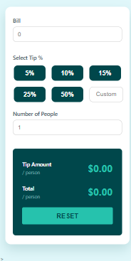

# 💰 Tip Calculator

A simple and interactive tip calculator built with HTML, CSS, and JavaScript that allows users to input a bill amount and tip percentage to instantly calculate the total and per-person split.

🔗 **Live Demo:** [your-live-link-here](#)

---

## 📸 Screenshots

### App View

---

## ✨ Features

- 💵 **Bill Input** — Enter your total bill amount
- 💡 **Tip Percentage** — Choose from preset options: 5%, 10%, 15%, 25%, 50%
- ✏️ **Custom Tip** — Enter any custom tip percentage
- 👥 **Split Bill** — Enter number of people to split the bill
- 🧮 **Instant Calculation** — Tip amount and total updates in real-time
- 🔄 **Reset Button** — Clear all inputs and start fresh

---

## 🛠️ Tech Stack

| Technology | Usage |
|---|---|
| HTML5 | Structure |
| CSS3 | Styling & Layout |
| JavaScript (Vanilla) | Logic & Calculations |

---

## 📁 Project Structure

    tip-calculator/
    │
    ├── index.html
    ├── style.css
    └── script.js
    └── fevico.ico
    └── README.md

---

## 🚀 How It Works

1. Enter the total bill amount
2. Select a tip percentage — or enter a custom value
3. Enter the number of people splitting the bill
4. Tip amount and total per person are calculated instantly
5. Click Reset to clear everything and start over

---

## 🧮 Formula Used

    Tip Amount per person = (Bill × Tip%) ÷ Number of People
    Total per person = (Bill + Tip Amount) ÷ Number of People

---

## 👨‍💻 Author

**Muhammad Saad**
- GitHub: [@MuhammadSaad-55](https://github.com/MuhammadSaad-55)

---

⭐ **If you like this project, give it a star!**